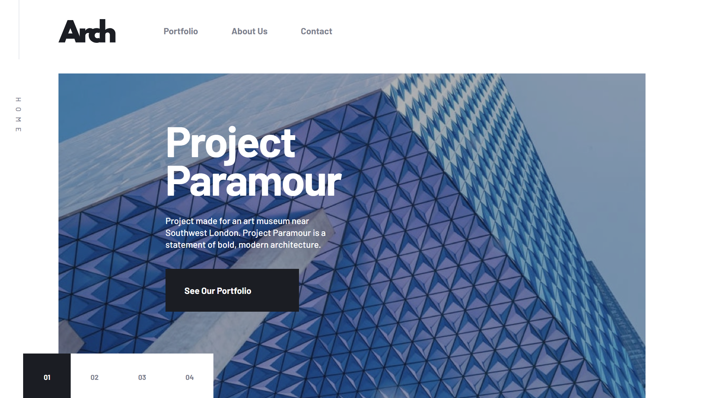

# Arch Studio

A responsive multi-page architecture studio website built from the provided Figma design.

## Preview



## Pages

- Home
- Portfolio
- About Us
- Contact
- Custom 404 page

## Features

- Responsive mobile, tablet, and desktop layouts
- Interactive home-page project carousel
- Responsive images for each viewport size
- Mobile navigation menu
- Portfolio project grid
- Contact details, map, and contact form UI
- Custom page metadata and 404 page
- Keyboard focus styles and reduced-motion support
- Semantic HTML landmarks, headings, navigation, lists, forms, and buttons

## Tech Stack

- Next.js 16
- React 19
- TypeScript
- Tailwind CSS 4
- ESLint
- `next/image` for optimized images
- `next/font` with the Barlow typeface
- React Icons

## Getting Started

### Requirements

- Node.js 20.9 or later
- npm

### Install dependencies

```bash
npm install
```

### Start the development server

```bash
npm run dev
```

Open [http://localhost:3000](http://localhost:3000) in your browser.

### Create a production build

```bash
npm run build
```

### Start the production server

```bash
npm run start
```

### Run linting

```bash
npm run lint
```

## Project Structure

```text
app/
├── about/
│   └── page.tsx
├── contact/
│   └── page.tsx
├── portfolio/
│   └── page.tsx
├── assets/
│   ├── about/
│   ├── contact/
│   ├── home/
│   ├── icons/
│   └── portfolio/
├── components/
│   ├── FeaturedSection.tsx
│   ├── Footer.tsx
│   ├── Header.tsx
│   ├── HeroSection.tsx
│   ├── NavLink.tsx
│   ├── SmallTeamSection.tsx
│   └── WelcomeSection.tsx
├── data.ts
├── globals.css
├── layout.tsx
├── not-found.tsx
└── page.tsx
```

## Main Components

- `Header` — desktop navigation and mobile navigation menu
- `HeroSection` — interactive home-page project carousel
- `WelcomeSection` — studio introduction section
- `SmallTeamSection` — call-to-action section for the About page
- `FeaturedSection` — highlighted portfolio projects
- `Footer` — site navigation and portfolio call to action
- `NavLink` — reusable navigation link with active-page state

## Responsive Design

The project uses Tailwind’s standard responsive breakpoints:

- Mobile: default styles
- Tablet: `md` (`768px` and above)
- Desktop: `lg` (`1024px` and above)

Each main image has mobile, tablet, and desktop assets where needed.

## Accessibility

The interface includes:

- Semantic `header`, `nav`, `main`, `section`, `footer`, `article`, `figure`, and `form` elements
- Accessible navigation labels
- Current-page indication using `aria-current`
- Accessible carousel labels and slide controls
- Proper form labels
- Keyboard focus states
- Decorative images hidden from assistive technology
- Reduced-motion styles for animations

## Design Reference

Built from the Arch Studio multi-page website design provided in Figma.

## Author

Peter Paing
